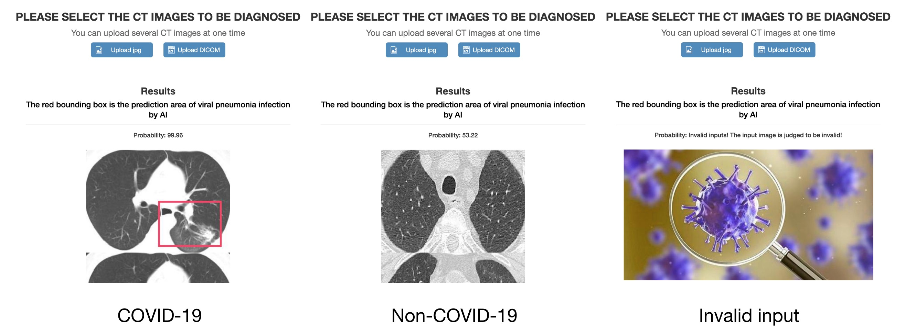

# Deep learning enables accurate diagnosis of novel coronavirus (COVID-19) with CT images
The source code of [*Deep learning enables accurate diagnosis of novel coronavirus (COVID-19) with CT images*](https://www.medrxiv.org/content/10.1101/2020.02.23.20026930v1).

# 1. Our platform
Please visit [*COVID19-CT images diagnosis*](http://biomed.nscc-gz.cn:8901/dist/index.html#/user/modelList).
I would like to suggest you to upload a group of CT images (for example, upload 10 images) at once, and you will get a more accurate result.



## Demo
+ Left: COVID-19 images. 
+ Middle: Non-COVID-19 images. Actually, these are CT images of bacterial pneumonia. 
+ Right: Invalid image. At present, our server only serves specific hospitals. If you want to test CT images from other hospitals, please 

# 2. Using pretrained model
For local prediction, please download [*model.ckpt*](https://drive.google.com/file/d/1vGOnn_KPy9InVgGdymivurewcWIK5f0X/view?usp=sharing) and put it into dir /online_backend/, run:
```
python run.py DIR
```
where `DIR` includes a set CT JPEG images of one person.

# 3. Using your own dataset
First, you should convert your CT images into `JPG` format.

We recommand the following file structure:

    DATASET_ROOT_DIR
    └── INPUT_DIR
        ├── Person 1
        |   ├── image_1
        |   ├── image_2
        |   ├── ...
        |   └── image_n
        ├── Person 2
        ├── ...
        └── Person m

Then, run `/local_trainer/pre_cut_lung.py INPUT_DIR OUTPUT_DIR` to preprocess the images.
